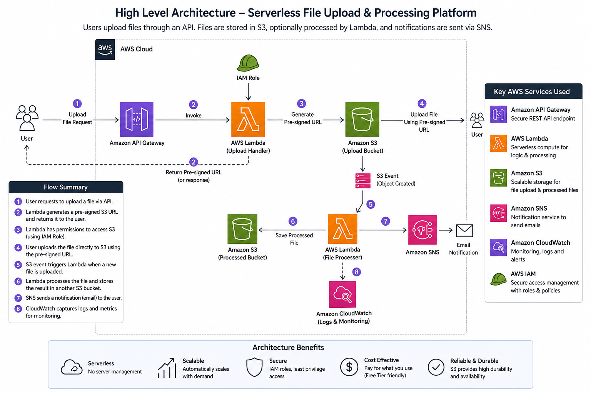

# AWS Serverless File Upload & Processing Platform

## Overview

This project demonstrates a scalable, event-driven serverless architecture on AWS. The platform securely uploads files to Amazon S3 using pre-signed URLs generated through AWS Lambda and Amazon API Gateway. Uploaded files automatically trigger serverless processing workflows using S3 Event Notifications, followed by SNS email notifications and CloudWatch monitoring

User -> API Gateway -> Upload Lambda -> Pre-Signed URL -> S3 Upload Bucket -> S3 Event Notification -> Processor Lambda -> Processed Bucket -> SNS -> Email Notification 

## Tech Stack

* AWS Lambda
* Amazon S3
* API Gateway
* SNS
* CloudWatch
* IAM

## Features

- Secure pre-signed uploads
- API Gateway integration
- Event-driven Lambda processing
- SNS email notifications
- CloudWatch alarms
- Least privilege IAM

## Architecture Diagram

